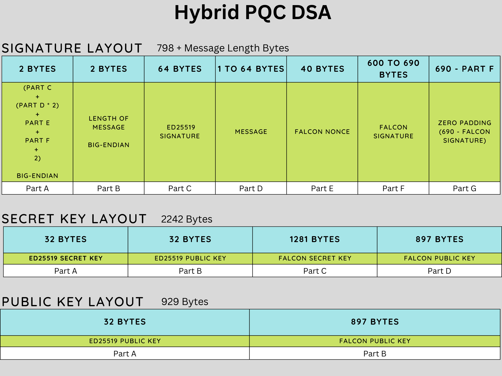

[](https://github.com/DogeProtocol/hybrid-pqc/actions/workflows/cmake-multi-platform.yml)

# Hybrid Post Quantum Cryptography
While lattice based post-quantum cryptography schemes such as Falcon and Dilithium have been standardized, they haven’t 
been battle-tested widely over the years like RSA and Elliptic Curve vased crypto-schemes. It's possible that newer category of attacks on Lattice based cryptography may come to light.

Because of these reasons, it's preferable to use a hybrid signature scheme that 
uses two crypto schemes behind the scenes: a PQC scheme and a classical scheme (EdDSA). This hybrid 
model is required to provide a hedge against Lattice based cryptography schemes such as Falcon getting broken 
on classical computers in the interim. 

When quantum computers capable enough to break EdDSA become available, the hybrid model 
will still provide protection against quantum computer attacks, since a post quantum crypto scheme is used in the hybrid model. 

This hybrid model will be abstracted away so that users do not have to worry 
about managing two sets of keys. To users, it will be just one composite key to manage and 
use. Likewise, higher-level developers do not have to worry about the hybrid 
model, since it will be abstracted away.

Some disadvantages of the hybrid model are increased complexity, increased risk of implementation bugs, increased compute time, increased 
storage, and bandwidth requirements. However, the security benefits of the hybrid model outweigh these disadvantages.

## Deterministic Key Generation
A deterministic version of key generation has also been added. For example, this can be used for seed phrase based wallet generation for blockchains. The size of the seed is 80 bytes; 48 bytes for Falcon and 32 bytes for ed25519. The seed should be generated using a CSPRNG. 

### Warning
This is test software, not yet ready for production use. Do not use in production systems!

## Falcon
Falcon is a Post Quantum Digital Signature Scheme that has been standardized by NIST.
This repository is based on the Falcon512 reference imlpementation at [Round 3](https://csrc.nist.gov/Projects/post-quantum-cryptography/post-quantum-cryptography-standardization/round-3-submissions) submission of Falcon. 

## EdDSA
The classical digital signature algorithm used is EdDSA (ed25519). The implementation used is [TweetNaCl](https://tweetnacl.cr.yp.to/), a self-contained public-domain C library. (https://tweetnacl.cr.yp.to/)

## Randombytes
The random implementation is based on (https://github.com/dsprenkels/randombytes), which itself is based on libsodium randombytes.

### Source
[https://csrc.nist.gov/CSRC/media/Projects/post-quantum-cryptography/documents/round-3/submissions/Falcon-Round3.zip](https://csrc.nist.gov/CSRC/media/Projects/post-quantum-cryptography/documents/round-3/submissions/Falcon-Round3.zip)

```SHA256: fd58f0454f6bfb4713734e60b2d2d75d96fbae62d5180fceeef1039df5362f44```

### Layout


### Performance
These numbers were evaluated on an [AWS t2.medium instance](https://aws.amazon.com/ec2/instance-types/t2/) over 10000 iterations (single threaded), running Ubuntu. Note that this instance type has burstable CPU performance, hence the following numbers are approximate. The reference implementation of Falcon512 from NIST Round 3 and ed25519 implementation from (https://tweetnacl.cr.yp.to/) was used.

1. Generate Key Pair : 25 ms (40 per second)
2. Sign: 8.5 ms (115 per second)
3. Sign Open: 3.6 ms (280 per second)
4. Verify: 3.6 ms  (280 per second)

## Building

### Linux/macOS

1. Install dependencies:

	On Ubuntu:

		 apt-get update
		 sudo apt install astyle cmake gcc ninja-build libssl-dev python3-pytest python3-pytest-xdist unzip xsltproc doxygen graphviz python3-yaml

	On macOS, using a package manager of your choice (we've picked Homebrew):

		brew install cmake ninja openssl@1.1 wget doxygen graphviz astyle
		pip3 install pytest pytest-xdist pyyaml

2. Get the source:

		git clone https://github.com/dogeprotocol/hybrid-pqc.git
		cd hybrid-pqc

	and build:

		mkdir build && cd build
		cmake -G Ninja -DBUILD_SHARED_LIBS=ON ..
		ninja

### Windows

Binaries can be generated using Visual Studio 2019 with the [CMake Tools](https://marketplace.visualstudio.com/items?itemName=ms-vscode.cmake-tools) extension installed. The same options as explained above for Linux/macOS can be used and build artifacts are generated in the specified `build` folders.

If you want to create Visual Studio build files, e.g., if not using `ninja`, be sure to _not_ pass the parameter `-GNinja` to the `cmake` command as exemplified above. You can then build all components using `msbuild`, e.g. as follows: `msbuild ALL_BUILD.vcxproj` and install all artifacts e.g. using this command `msbuild INSTALL.vcxproj`.

### Web Assembly WASM

1. Install emsdk https://www.tutorialspoint.com/webassembly/webassembly_installation.htm
2. Goto directory of emsdk and run: emsdk_env.bat
3. Create build folder. For example: c:\github\hybrid-pqc\wasm\build
4. Run the following command, replacing appropriate paths:


		emcc -s WASM=1 -s EXPORTED_FUNCTIONS="['_free', '_malloc']"  -s "EXPORTED_RUNTIME_METHODS=['getValue']" ${{ github.workspace }}/wasm/hybrid-pqc.c ${{ github.workspace }}/dilithium2/ntt.c ${{ github.workspace }}/dilithium2/packing.c ${{ github.workspace }}/dilithium2/poly.c ${{ github.workspace }}/dilithium2/polyvec.c ${{ github.workspace }}/dilithium2/reduce.c ${{ github.workspace }}/dilithium2/rounding.c ${{ github.workspace }}/dilithium2/sign.c ${{ github.workspace }}/dilithium2/symmetric-shake.c ${{ github.workspace }}/sphincs/address.c ${{ github.workspace }}/sphincs/context_shake.c ${{ github.workspace }}/sphincs/fors.c ${{ github.workspace }}/sphincs/hash_shake.c ${{ github.workspace }}/sphincs/merkle.c ${{ github.workspace }}/sphincs/sign.c ${{ github.workspace }}/sphincs/thash_shake_simple.c ${{ github.workspace }}/sphincs/utils.c ${{ github.workspace }}/sphincs/utilsx1.c ${{ github.workspace }}/sphincs/wots.c ${{ github.workspace }}/sphincs/wotsx1.c  ${{ github.workspace }}/random/randombytes.c ${{ github.workspace }}/common/fips202.c ${{ github.workspace }}/common/hybrid-common.c ${{ github.workspace }}/common/shake_prng.c ${{ github.workspace }}/tweetnacl/tweetnacl.c  ${{ github.workspace }}/hybrid-dilithium-sphincs/hybrid.c -o ${{ github.workspace }}/build/wasm/hybrid-pqc.html

## Contributing

Thank you for considering to help out with the source code! 

* Please reach out in [our Discord Server](https://discord.gg/bbbMPyzJTM) for any questions. 
* Pull requests need to be based on and opened against the `main` branch.

## License

This Falcon implementation is provided under the MIT license, whose text
is included at the start of every source file.
Random bytes and Hybrid also have their own license files (MIT License).
