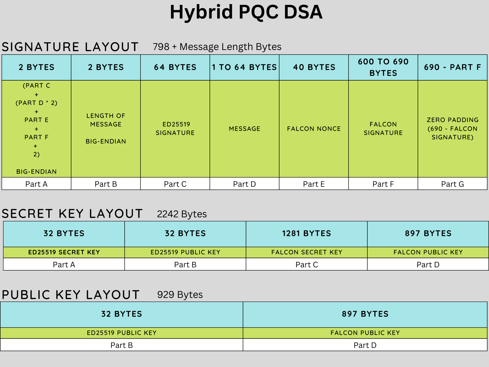

# Hybrid Post Quantum Cryptography
While both Falcon and Dilithium have been standardized, these two Digital Signature Schemes schemes haven’t 
been battle-tested widely. It's possible that newer category of attacks on Lattice based cryptography may come to light.

Because of these reasons, it's preferable to use a hybrid signature scheme that 
uses two crypto schemes behind the scenes: a PQC scheme and a classical scheme (ECDSA). This hybrid 
model is required to provide a hedge against Falcon or Dilithium getting broken 
on classical computers in the interim. 

When quantum computers capable enough to break ECDSA become available, the hybrid model 
will still provide protection against quantum computer attacks, since a post quantum crypto scheme is used in the hybrid model. 

This hybrid model will be abstracted away so that users do not have to worry 
about managing two sets of keys. To users, it will be just one composite key to manage and 
use. Likewise, higher-level developers do not have to worry about the hybrid 
model, since it will be abstracted away.

Some disadvantages of the hybrid model are increased complexity, increased compute time, increased 
storage, and bandwidth requirements. However, the security benefits of the 
hybrid model outweigh these disadvantages.

### Warning
This is test software, not yet ready for production use. Do not use in production systems.

## Falcon
Falcon is a Post Quantum Digital Signature Scheme that has been standardized by NIST.
This repository is based on the Falcon512 reference imlpementation at [Round 3](https://csrc.nist.gov/Projects/post-quantum-cryptography/post-quantum-cryptography-standardization/round-3-submissions) submission of Falcon. 

## EdDSA
The classical digital signature algorithm used is EdDSA (ed25519). The implementation used is [TweetNaCl](https://tweetnacl.cr.yp.to/), a self-contained public-domain C library. (https://tweetnacl.cr.yp.to/)

## Randombytes
The random implementation is based on (https://github.com/dsprenkels/randombytes), which itself is based on libsodium randombytes.

### Source
[https://csrc.nist.gov/CSRC/media/Projects/post-quantum-cryptography/documents/round-3/submissions/Falcon-Round3.zip](https://csrc.nist.gov/CSRC/media/Projects/post-quantum-cryptography/documents/round-3/submissions/Falcon-Round3.zip)

```SHA256: fd58f0454f6bfb4713734e60b2d2d75d96fbae62d5180fceeef1039df5362f44```

### Layout


## Building

### Linux/macOS

1. Install dependencies:

	On Ubuntu:

		 apt-get update
		 sudo apt install astyle cmake gcc ninja-build libssl-dev python3-pytest python3-pytest-xdist unzip xsltproc doxygen graphviz python3-yaml

	On macOS, using a package manager of your choice (we've picked Homebrew):

		brew install cmake ninja openssl@1.1 wget doxygen graphviz astyle
		pip3 install pytest pytest-xdist pyyaml

2. Get the source:

		git clone https://github.com/dogeprotocol/hybrid-pqc.git
		cd hybrid-pqc

	and build:

		mkdir build && cd build
		cmake -G Ninja -DBUILD_SHARED_LIBS=ON ..
		ninja

### Windows

Binaries can be generated using Visual Studio 2019 with the [CMake Tools](https://marketplace.visualstudio.com/items?itemName=ms-vscode.cmake-tools) extension installed. The same options as explained above for Linux/macOS can be used and build artifacts are generated in the specified `build` folders.

If you want to create Visual Studio build files, e.g., if not using `ninja`, be sure to _not_ pass the parameter `-GNinja` to the `cmake` command as exemplified above. You can then build all components using `msbuild`, e.g. as follows: `msbuild ALL_BUILD.vcxproj` and install all artifacts e.g. using this command `msbuild INSTALL.vcxproj`.

#### Windows alternate installation method
If any of the below files are not available for download, you may have to download a newer version from their corresponding project file locations.
1. Download cmake: https://github.com/Kitware/CMake/releases/download/v3.25.1/cmake-3.25.1-windows-x86_64.zip
2. Extract the downloaded file to c:\cmake (such that bin folder location is c:\cmake\bin)
3. Download ninja: https://github.com/ninja-build/ninja/releases/download/v1.11.1/ninja-win.zip
4. Extract the downloaded file to c:\ninja
5. Download compiler tools: https://github.com/niXman/mingw-builds-binaries/releases/download/12.2.0-rt_v10-rev2/x86_64-12.2.0-release-win32-seh-msvcrt-rt_v10-rev2.7z
6. Extract the downloaded file to C:\mingw64 (such that the bin folder location is C:\mingw64\bin). You may require 7z file extractor that can be downloaded from https://www.7-zip.org/
7. Set the environment variables as below:

       set PATH=%PATH%;c:\cmake\bin;c:\ninja;c:\mingw64\bin
8. Get the source:

		git clone https://github.com/dogeprotocol/hybrid-pqc.git
		cd hybrid-pqc

	and build:

		mkdir build 
		cd build
		cmake -G Ninja -DBUILD_SHARED_LIBS=ON ..
		ninja    

## Contributing

Thank you for considering to help out with the source code! 

* Please reach out in [our Discord Server](https://discord.gg/bbbMPyzJTM) for any questions. 
* Pull requests need to be based on and opened against the `main` branch.

## License

This Falcon implementation is provided under the MIT license, whose text
is included at the start of every source file.
